# Vigilant Bean webstore

A web store built on Java platform.

---

## Table of contents
1. [UML diagram](#UML)
2. [Technologies and Frameworks](#technologies)
3. [Features](#features)
4. [Demo](#showcase)
    1. [Main Page](#showcaseMainPage)
    2. [Searching for products](#showcaseProductSearch)   
    3. [Registration](#showcaseRegistration)
    4. [Adding products to cart](#)  
    5. [Adding new Category](#showcaseNewCategory)
    6. [Adding new Product](#showcaseNewProduct)
5. [How to set up](#howToSetUp)    


<a name="UML"></a>
### UML diagram of business entities


<a name="technologies"></a>
### Technologies and frameworks used:
* Spring
    * Spring Core
    * Spring MVC
    * Spring Security
* Hibernate
* Hibernate Validator
* JUnit5
* AssertJ  
* Mockito

<a name="features"></a>
### Features
* User management
  * Registration with Email confirmation
  * Password hashing  
  * Access control based on roles
  
* Product management
    * Paginated listing of Products
    * Product search
    * Adding/Removing/Changing quantity of products in cart  
    * Grouping products by Categories (Many to many)
    * Adding new Products (admin)
    * Adding new Categories (admin)

<a name="showcase"></a>
### Demo

---
<a name="showcaseMainPage"></a>
#### Main page
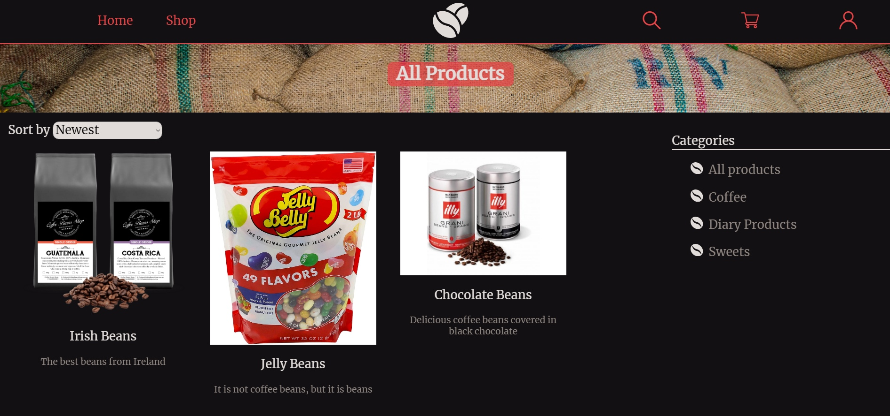

<a name="showcaseProductSearch"></a>
#### Product search
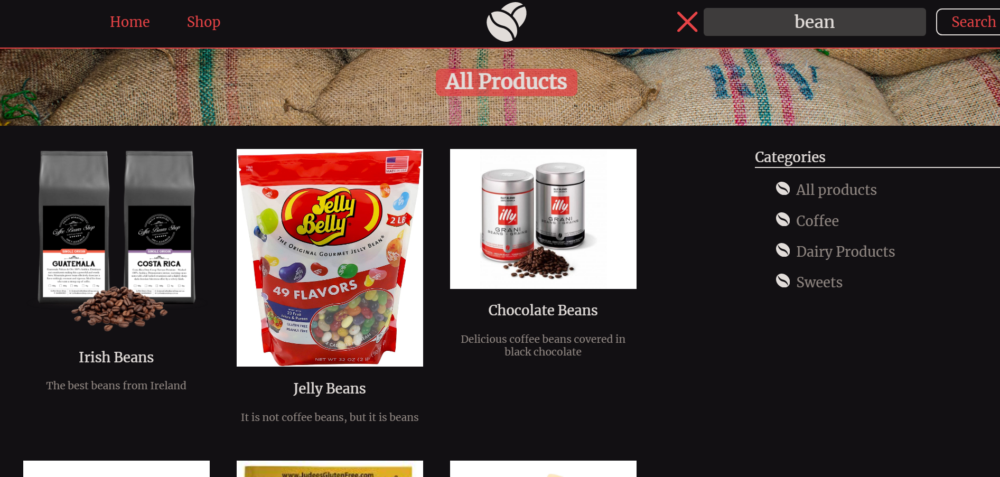
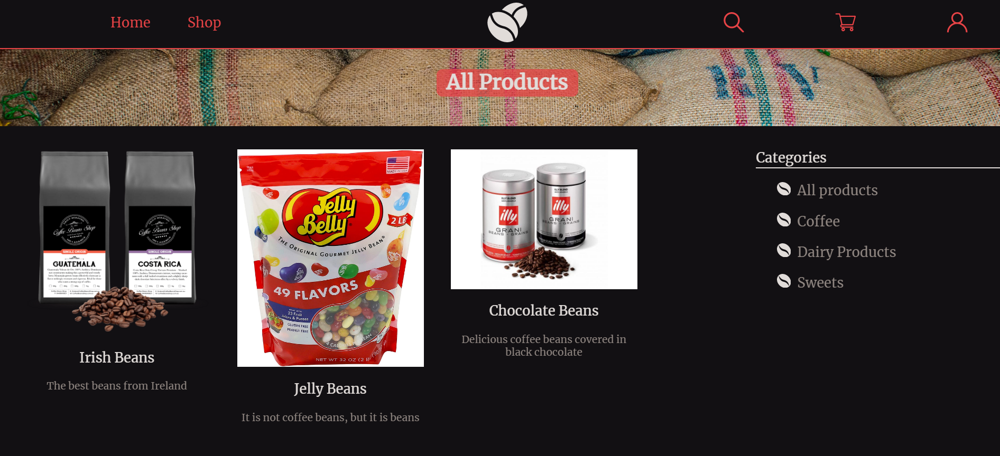

<a name="showcaseRegistration"></a>
#### Registration
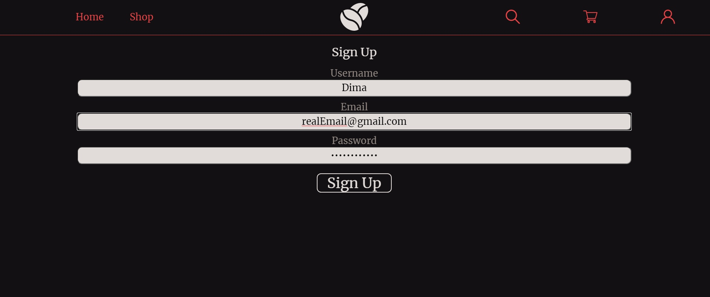
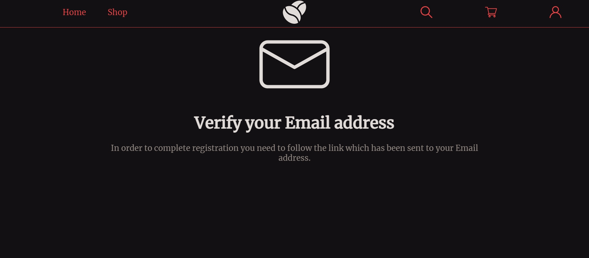

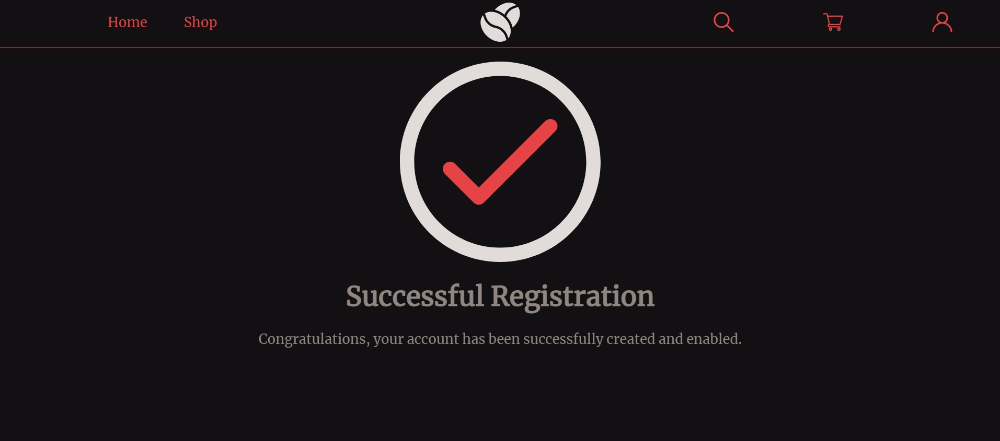
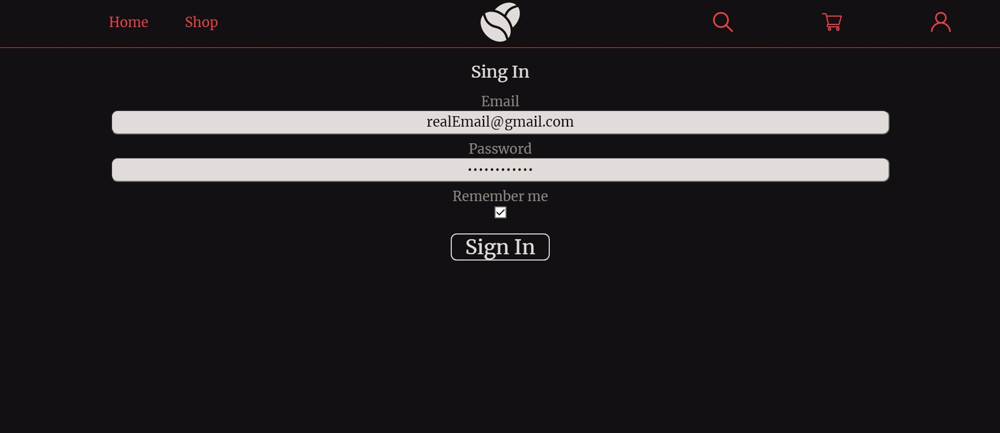
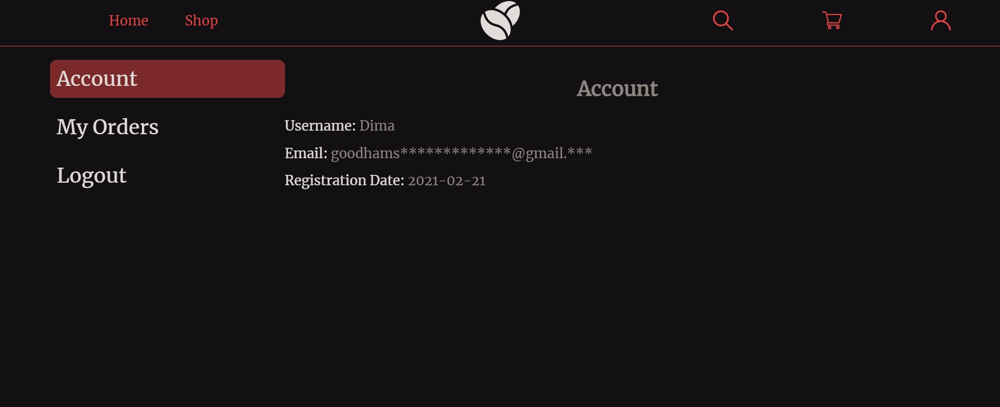

<a name="showcaseAddingProductsToCart"></a>
#### Adding products to cart
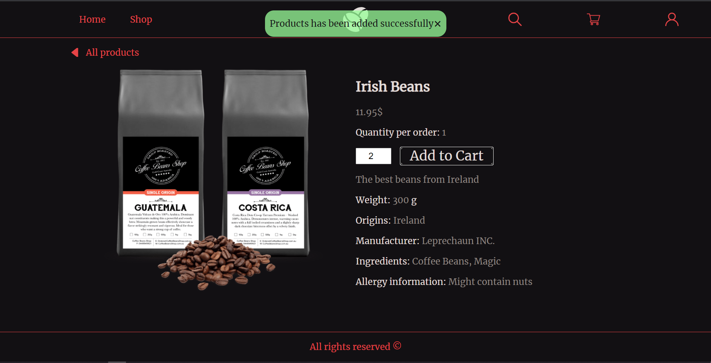
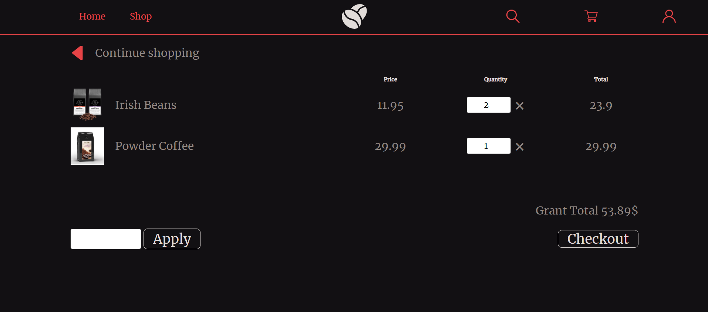

<a name="showcaseNewCategory"></a>
#### Adding new category (admin)
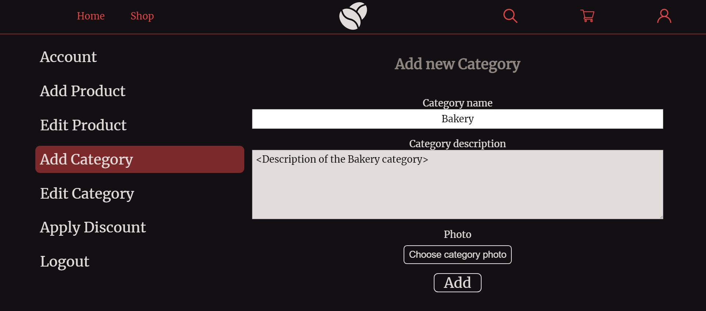
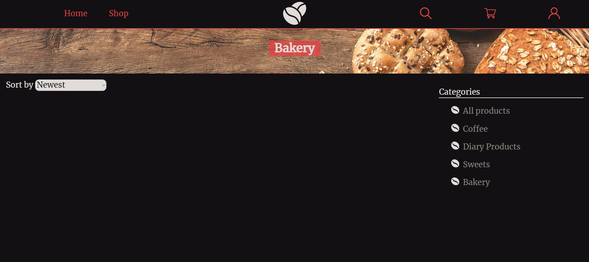

<a name="showcaseNewProduct"></a>
#### Adding new product (admin)
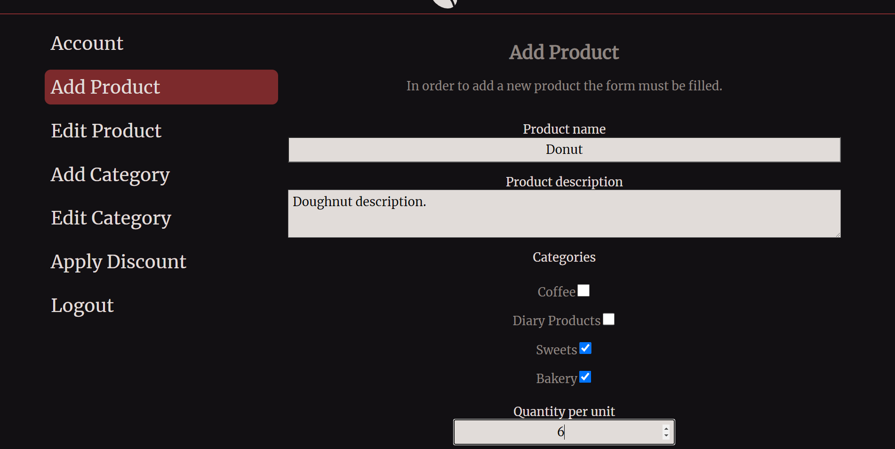
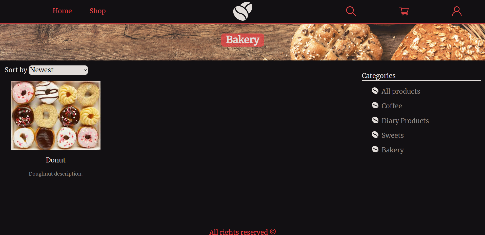
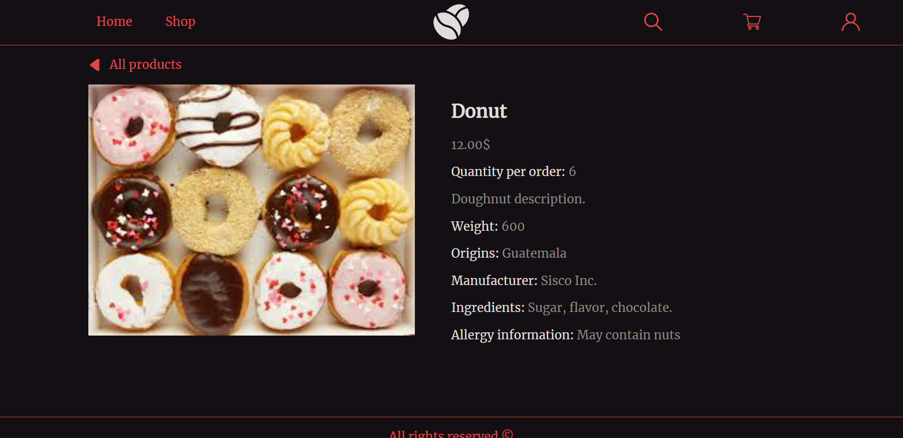


<a name="howToSetUp"></a>
### How to set up
1. Supply hibernate configuration properties in
```src/main/resources/hibernateConfig.properties```file
2. Supply mail sender configuration properties in 
   ```src/main/resources/hibernateConfig.properties``` file
3. Use Jetty Maven plugin to run the project


    

  